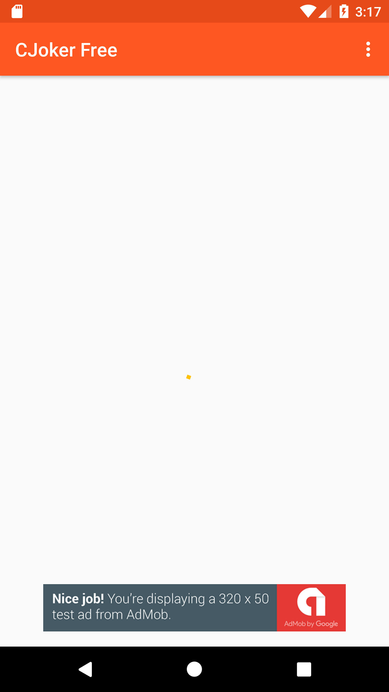
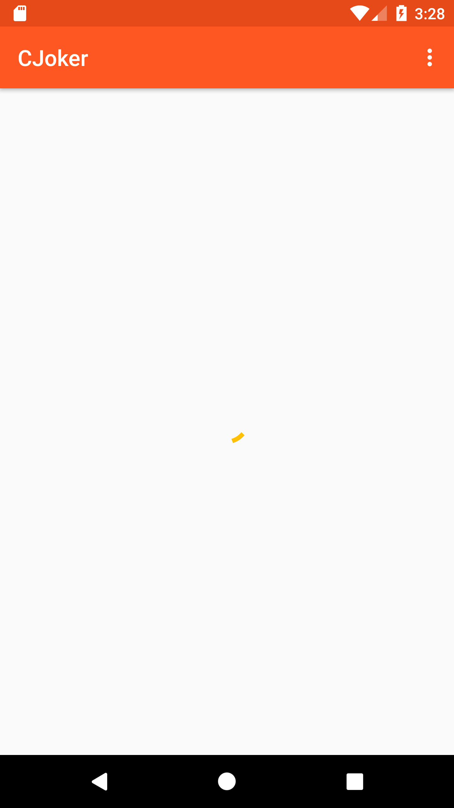

# Complete Joker

Concept project created to exercise a few ideas regarding gradle multiproject builds.
The idea behind it is a simple application able to fetch jokes from a server and display them to the user.

This project was created as an exercise for the Udacity Android Nanodegree program and the starting project can be found [here](https://github.com/udacity/ud867/tree/master/FinalProject).

## Table of Contents
* [Showcase Free Flavor](#showcase-free)
* [Showcase Paid Flavor](#showcase-paid)
* [Feature List](#features)
* [Project Structure](#structure)
* [Running End To End Tests](#testing)

<a name="showcase-free"></a>
## Showcase Free Flavor

<p align="center">
  
  
  
  
</p>

<a name="showcase-paid"></a>
## Showcase Paid Flavor

<p align="center">
  
  
  
</p>

<a name="features"></a>
## Feature List

* Fetches Jokes from a cloud service.
* Displays the fetched Jokes to the user.
* Banner and Interstitial Ads for the free version.
* Ad free paid version.
* Appengine server side application to provide jokes.

<a name="structure"></a>
## Project Structure

The final project is composed of four sub projects:

* app: android application to be used to consume jokes.
* jokerpresenter: android library that provides a simple view to render fetched jokes.
* jokeRepository: java library that generates and provides jokes.
* joker-api: appengine project that provides jokes provided by the jokeRepository library through an endpoint.

<a name="testing"></a>
## Running End To End Tests

A custom gradle task to run automated tests on the application is provided: `endToEndTest`. 

This task is responsible for starting the appengine server, deploying and testing free and paid flavors of the app and shutting the appengine server down.

It is important to notice that you need to have a connected android emulator to use this task.

From the project root directory issue the following command:

```
./gradlew endToEndTest
```

License
-------

    Copyright 2017 Eduardo Carrara de Araujo

    Licensed under the Apache License, Version 2.0 (the "License");
    you may not use this file except in compliance with the License.
    You may obtain a copy of the License at

       http://www.apache.org/licenses/LICENSE-2.0

    Unless required by applicable law or agreed to in writing, software
    distributed under the License is distributed on an "AS IS" BASIS,
    WITHOUT WARRANTIES OR CONDITIONS OF ANY KIND, either express or implied.
    See the License for the specific language governing permissions and
    limitations under the License.
